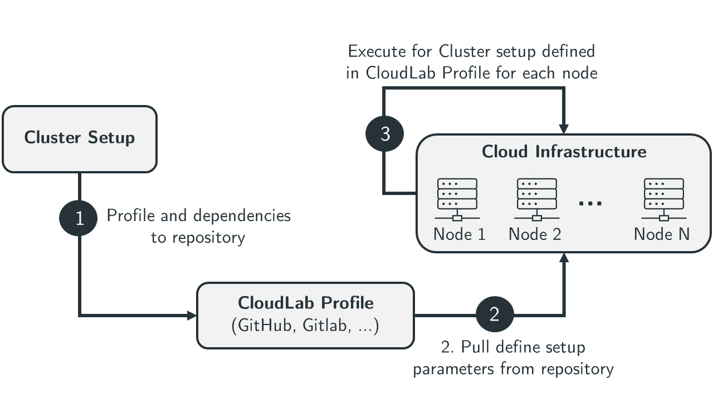

<h1> PDSP-Bench CloudLab Cluster Setup </h1>

CloudLab Cluster offers research testbed that enable researchers to construct their own distributed clouds environment for evaluations and experiments. 
It offers researchers to use bare metal hardwares for the creation of numerous isolated "slices," each providing a pristine environment ideal for experimental research on new cloud architectures. 

This is a demonstration of a *repository-based* Cloudlab profile. Repository based profiles are a great way to combine a git repository (for source code control) and a Cloudlab profile (for experiment control). The Cloudlab profile that is based on this repository can be found [here](https://www.cloudlab.us/p/PortalProfiles/RepoBased).

## Getting Started with Cluster Manager

1. [Prerequisite](#prerequisite)
1. [General Steps](#general)
1. [Setup CloudLab Cluster](#setupCluster)
1. [Important Notes](#importantNotes)
1. [Next steps: Setup and Start Controller](https://github.com/pdspbench/PDSPBench/tree/master/pdsp-bench_controller#readme)

## Prerequisite<a name="prerequisite"></a>
- `CloudLab` - Create CloudLab account. [CloudLab](https://www.cloudlab.us/) is well known to offer infrastructure of bare metal server to researcher. You can easily create your account for free and access all the available resource. However, PDSP-Bench is not limited to CloudLab. Researchers can use their onw infrastructure to setup and explore the capabilites of PDSP-Bench. For PDSP-Bench, we used CloudLab for experiments and evaluation due wide availability of resources. 
- `Docker` - We are using Docker to install and manage dependencies for workload generation. You can create your docker register from [hub.docker.com](https://hub.docker.com/).

## General steps: Cluster Configuration using CloudLab<a name="general"></a> 

- After creating your account on CloudLab, [pdsp-bench_Cloud_setup](https://github.com/pdspbench/PDSPBench/tree/master/pdsp-bench_Cloud_setup#readme) can be used to begin the cluster setup process. It includes all necessary configuration files and profiles to configure the cloud environment. The experiment profile can be created using CloudLab which can be linked to a corresponding profile [pdsp-bench_Cloud_setup](https://github.com/pdspbench/PDSPBench/tree/master/pdsp-bench_Cloud_setup#readme). CloudLab utilizes this link to clone the setup files from GitLab/GitHub into the newly created profile. The entire process is streamlined to ensure minimal user intervention and a quick transition from setup to execution. 

<h1 align="center">

</h1>

As shown in the figure , the setup process unfolds as follows. 

1. **Repository Cloning:** CloudLab automatically clones the setup files from the specified repository into a new profile that has been designated by the user.

2. **Profile Configuration and Instantiation:**  When initiating a cluster for experiment setup, CloudLab prompts the user to specify the desired number of nodes and select the type of hardware for each node. This interaction ensures that the hardware preferences of users are accurately captured and applied.

3. **Cluster Deployment and Service Initialization:** After the user finalizes their choices, CloudLab proceeds to deploy a cluster consisting of the specified number of nodes, each configured with the chosen hardware types. During this phase, CloudLab also replicates all files from the GitLab repository across every node in the cluster. Following the successful distribution of files, CloudLab executes installation shell scripts on each node. These scripts are crucial for setting up the necessary environment and services on the nodes. Once the installation scripts have successfully run and all services are started, the cluster is fully operational and ready to perform benchmarking tasks.

### Essential setup scripts

* **Profile.py** - This Python script outlines the cluster specifications for instantiation. It enables customization of the cluster setup by allowing user inputs for hardware selection, the number of nodes, and other parameters. The script also specifies the sequence of scripts to execute on the newly provisioned nodes, such as Preconditioning.sh followed by Install_all_tools.sh.

* **Preconditioning.sh:** This script is responsible for setting up the initial environment on the nodes. It creates the necessary folder structure, and installs Java, Python, and their related dependencies. 

* **Install_all_tools.sh:** This script installs essential tools on the Master Node, including `Flink`, `Kafka`, `Grafana`, and `Prometheus`. It also handles the copying of the JAR file, which contains the Flink jobs and Data Producer, to the Master Node.

* **Download_dataset.sh:**  Due to CloudLab's restrictions on the size of the repository that can be cloned into a CloudLab profile, datasets are not included in the initial cloud setup module. Instead, the data is hosted on `Kaggle`, and this script contains commands to download the dataset directly from Kaggle to the Master Node.

## Setup CloudLab Cluster<a name="setupCluster"></a> 

- Navigate to [CloudLab](https://www.cloudlab.us/)
- Login to the portal or create your account.
- Create profile for your project by linking to repository [pdsp-bench_Cloud_setup](https://github.com/pdspbench/PDSPBench/tree/master/pdsp-bench_Cloud_setup#readme), e.g., PDSP-Bench profile.
- Create experiment cluster by intantiating new experiment
    - Select number of nodes
    - Select type of hardware
    - Give a name to the cluster (optional)
    - Finally, instantiate the cluster
- Wait for the startup services to be run in all the nodes of the cluster. 
- Shell into the node 0 and find out the hostname by typing ```hostname ``` on the terminal.
- The other nodes have the similar hostname except the number followed after "node". ```node0.xxxxx.xxxx, node1.xxxx.xxxx, node2.xxxx.xxxx```


## Important notes for repository-based profiles set up<a name="importantNotes"></a>

* Your profile needs to be **publicly readable** so that we can pull from your
repository without needing credentials. If you want to use it privately then you can also use your **Gitlab access token** to access make profile readable and pull from your repository.

* Your repository must contain a file called `profile.py` (a geni-lib script) **or** `profile.rspec` (an rspec) in the top level directory. Your topology will be loaded from that file. Please place the source file in the toplevel directory.

* When you instantiate an experiment based on your profile, we will clone your repository to each of your experimental nodes in the `/local/repository` directory, and set it to match whatever branch or tag you have choosen to instantiate. You will not be able to push to your repository of course, until you install the necessary credentials on your nodes.

* You will be able to instantiate an experiment from any branch (HEAD) or tag in your repository; Cloudlab maintains a cache of your branches and tags and lets you select one when you start your experiment. (See below for information about telling Cloudlab to update its cache)

* *Execute* services run **after** the nodes have cloned your repository, so you may refer to the clone (in `/local/repository`) from your services. See `profile.py` in this repository for an example of how to run a program from your repository.

* Place anything you like in your repository, with the caveat that a giant repository (including, say, the linux source code), will take a long time to clone to each of your nodes. You might also get a message from Cloudlab staff asking about it.

### Using the same repository for multiple profiles:

Often it is convenient to point multiple profiles at the same repository. This is fine to do, although each profile would run the same script. Sometimes this is what you want to do, but often you would like different profiles to run a different scripts. To do this, create a subdirectory called `profiles` at the top level of the repository and move your `profile.py` or `profile.rspec` into the new sub directory.

If you want a specfic profile (say, `mynewprofile`) to run a different script then your other profile (say, `myoldprofile`), rename `profile.py` to `myoldprofile.py` and add a new script called `mynewprofile.py`.  When you instantiate or edit `mynewprofile`, the `mynewprofile.py` script will be used.

### Updating your profile after updates to your repository

When you change your repository you will typically want your Cloudlab profile to be updated as well, especially if you have changed `profile.py` or `profile.rspec`. But you might also have added a new branch or tag that you would like to instantiate. Before you can do that, you need to tell Cloudlab to update your profile. There are two ways to do that, one is a manual method and the other is an automated method:

#### Manual method

After you update your repository, return to the Cloudlab web interface, and on the `Edit Profile` page, you will see an **Update** button next to the repository URL. Click on the **Update** button, and Cloudlab will do another pull from your repository, update the list of branches and tags, and update the source code on the page if it has changed. 

#### Automated method

Many public Git repositories like [github.com](https://git-scm.com/), [bitbucket.org](https://bitbucket.org), and others based on [GitLab](https://www.gitlab.com/), support *push* 
[webhooks](https://developer.github.com/webhooks/), which is a mechanism to notify a third party that your repository has changed, either by a push to the repository or by the web interface.

Once you setup a push webhook, each commit to your repository will cause Cloudlab to fetch from your repository, updating your profile to reflect the current HEAD of your master branch. Branches and tags are updated as well. When complete, we will send you an email confirmation so you know that your profile has been updated. 

Setting up a webhook is relatively straightforward. First, on the `Edit Profile` page for your profile, copy the **Push URL** from the Repository Info panel in the lower left. Here are instructions for several popular Git hosting services: 

* **github.com**: Go to your repository and click on the **Settings** option in the upper right, then click on **Webhooks**, then click on the **Add Webhook** menu option. Paste your push URL into the **Payload URL** form field, leave everything else as is, and click on the **Add Webhook** button at the bottom of the form.

* **gitlab**: Go to your repository and click on **Settings** in the upper right, then click on the **Integrations** menu option.  Paste your push URL into the **URL** form field, leave everything else as is, and click on the **Add Webhook** button at the bottom of the form.

* **bitbucket.org**: Go to your repository and click on **Settings** in the lower left, then click on the **Webhooks** menu option, then click on the **Add Webhook** button. Give your new webhook a **Title** and paste your push URL into the **URL** form field, leave everything else as is, and click on the **Save** button at the bottom of the form.
