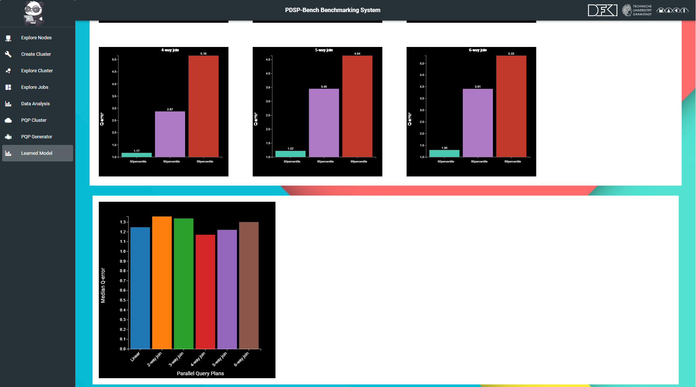

<h1> PDSP-Bench Learned Component of DSP System </h1>

PDSP-Bench learned component of DSP system offers benchmarking of accuracy of different learned cost models in predicting performance metrics such as latency and throughput for different parallel query plans. Currently, learned component offers four models selected based on their model architecture such as Linear regression, MLP, Random forest, GNN.


## Description of Learned Cost models

Currently, PDSP-Bench offers four learned cost models, each chosen for their distinct approaches to modeling and managing the complexities of stream processing queries. These models are trained for different query structures, including linear, two-way join, three-way join, and an overall model (including all three query structures). Each model incorporates corresponding enumeration strategies (random and rule-based) and performance metrics, ensuring comprehensive evaluation and prediction capabilities.

| **Learned Models** || **Description**  |
|----------------------------------------------------------------------------------|------------------------------------------|-----------------------------------------------------------------------------------------------------------------------------------------------------------------------------------------------------------------------------------------------------------------------------------------------------------------------------------------------------------------|
| Linear Regression (LR)                                       || traditionally used for its simplicity and effectiveness in prediction tasks.                                                                                                                                                           |
| Multi Layer Perceptron (MLP)                              || known for capturing nonlinear relationships in data.                                                                                                                                                                           |
| Random Forest (RF)                                    || utilizes decision trees to improve prediction accuracy.                                                                                                                                                          |
| Graph Neural Network (GNN)                        || applies graph structures to model complex relationships in data.                                                                                                                         |


## WUI: Workload Generation
With WUI allows prediction and performanc visualization of different learned cost models for both real-world and synthetic applications. In addition, you can use exiting command lines to use learned component of DSPS. 

#### Visual representation of Learned Component of DSPS

- Selecting learned cost model and corresponding parameters for prediction performance of parallel query plans.

    

- Preformance accuracy of individual query and compartive analysis of queries.

  
 
### Getting Started with Learned Components

1. Previous step if you are using WUI
    - [pdsp-bench_Cloud_setup:](https://github.com/pdspbench/PDSPBench/tree/master/pdsp-bench_Cloud_setup#readme) 
    - [pdsp-bench_controller:](https://github.com/pdspbench/PDSPBench/tree/master/pdsp-bench_controller#readme)
    - [pdsp-bench_workload_generator:](https://github.com/pdspbench/PDSPBench/tree/master/pdsp-bench_workload_generator#readme)
    - [pdsp-bench_wui:](https://github.com/pdspbench/PDSPBench/tree/master/pdsp-bench_wui#readme) 
1. [Prerequisites](#prerequisites)
1. [Prepare the data](#preparedata)
1. [Inference](#model)

## Prerequisites<a name="prerequisites"></a>
- If you are starting first time then 
    -   create training and optionally additional testdata by generating performance benchmarking data from frontend
    -   Verify that the test or training folder contain trained model

###  Prepare the Data<a name="preparedata"></a>

We have already prepared data for training and inference. These steps are only for information as we already added the trained model for prediction. The process involves refining a batch of generated queries for effective training and testing. Preprocessing steps are necessary to prepare the data properly. This necessitates a series of steps:

1. **Experiment Selection and Aggregation:** Relevant experiments are chosen based on factors like enumeration strategy or hardware used. Data from these experiments is then gathered in a single directory.

1. **Merging Data:** If an experiment was run multiple times due to errors, its graph files are combined into a common folder. Label files are also merged for consistency.

1. **Data Analysis:** Each graph file is checked for accurate operator feature counts. Cases where operators lack runtime data due to execution delays are identified.

1. **Label Validation:** The integrity of label collection is verified to ensure completeness.

1. **Consolidation of Experiment Setups:** All experiment setups are merged.

1. **Standardizing Query Counts:** To avoid bias, the query count per setup is adjusted to match the lowest query count.

1. **Randomization:** Queries are shuffled randomly to achieve a balanced distribution of experiment setups.

### Train the Exiting Model with New Data<a name="model"></a>
To train the model on a prepared dataset, call:
		
```
python3 main.py --
--training_data training_data/2022-01-04
--mode train
--metric throughput
```
#### Using the Trained Model to Predict Cost
While the above call just trains and test for the given dataset, the model can be afterwards applied to predict for new and unseen datasets. The plangenerator can generate several test datasets (extrapolation and benchmark sets). To optain predictions for those, please call:
```
python3 main.py --
--training_data /training_data/2022-01-04
--test_data test_data/2022-01-04
--mode test
--metric throughput
```

#### Testset predictions
To plot the predictions and q-errors for the unseen test set, call:

```
python plot_predictions_testset.py --dataset_path ./training_data/2022-02-0
```
#### Extrapolation predictions
To plot the predictions for the extrapolation experiment, call:
```
python3 plot_predictions_extrapolation.py --dataset_path /test_data/extrapolation
```
The predictions have to be obtained before (see above)

#### Benchmark predictions
To compute the median and 95th percentile Q-errors for the benchmarks (e.g. smartgrid), call:
```
python3 plot_predictions_benchmark.py
--dataset_paths 
./test_data/smartgrid 
./test_data/spikedetection 
./test_data/advertisement
./test_data/advertisement-join
```
