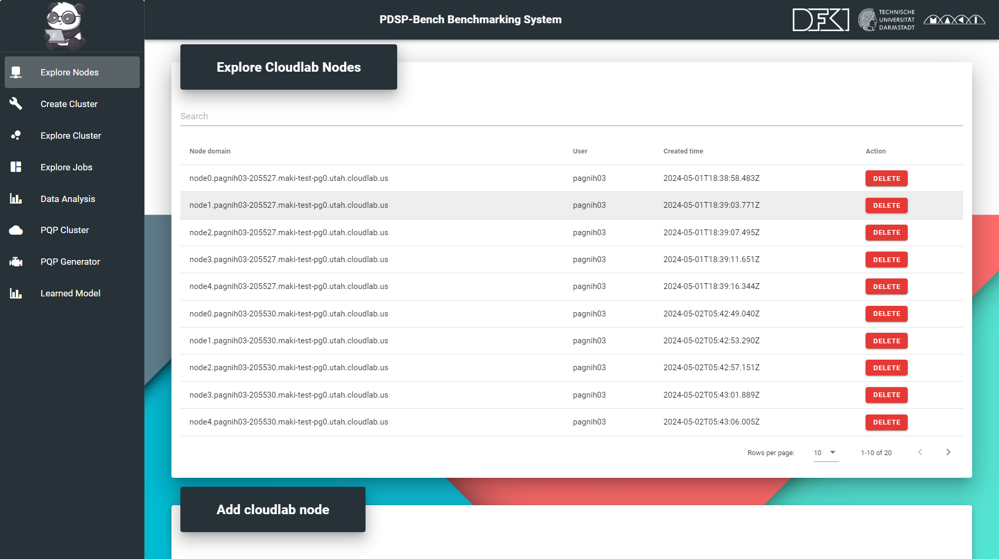
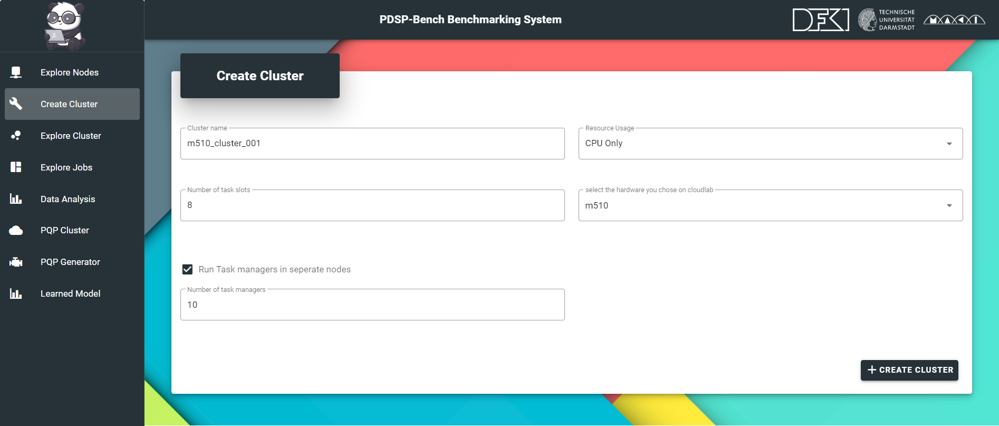
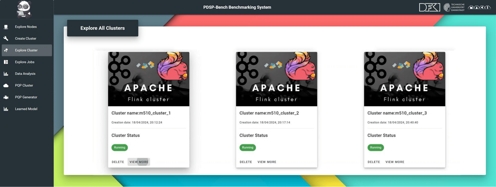
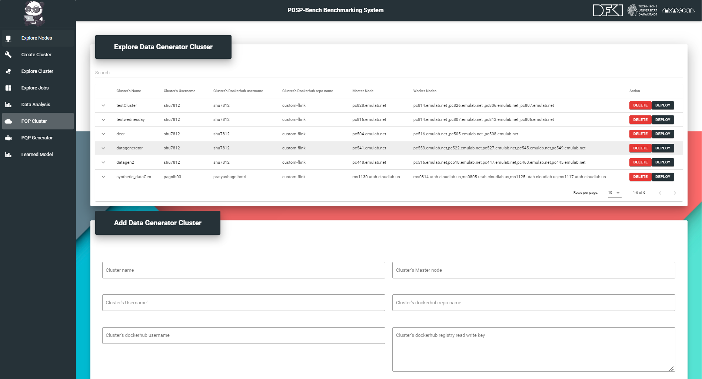
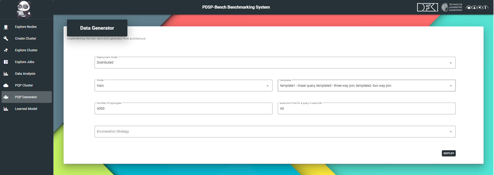
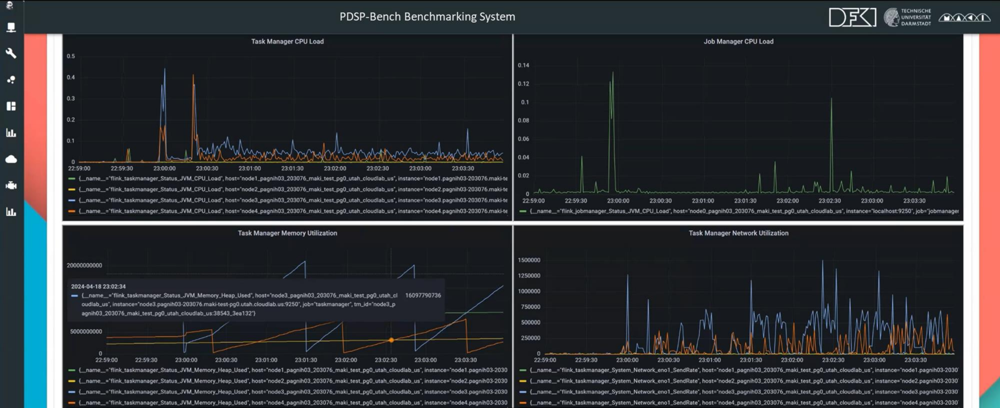
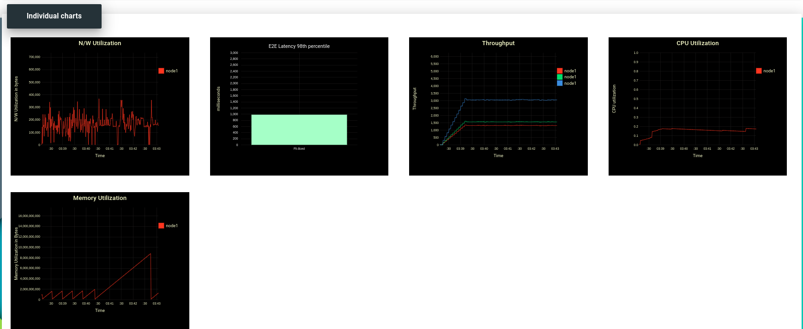
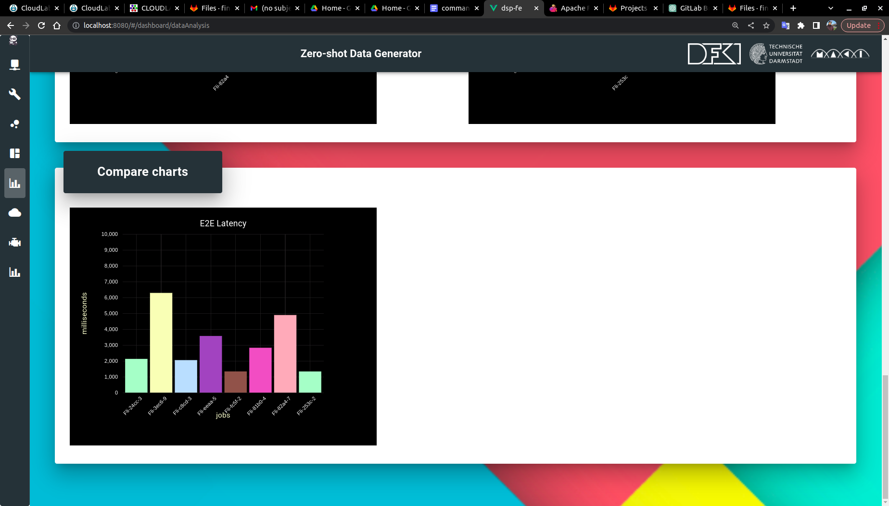

<h1> PDSP-Bench - Web User Interface (WUI) </h1>

In the context of~\ac{dsp} benchmarking, web user interface (WUI) of PDSP-Bench is designed to simplify the performance benchmarking and forecasting process. 
- It serves as a portal through which users can effortlessly deploy homogeneous and heterogeneous clusters, configure~\ac{dsp} settings, and select workloads and a variety of parallel query plans derived from both 14 real-world applications and 9 synthetic benchmarks. 
- It  acts as a gateway, forwarding user-defined benchmark configurations to the [pdsp-bench_controller:](https://github.com/pdspbench/PDSPBench/tree/master/pdsp-bench_controller#readme), which orchestrates the initiation of the benchmarking process. 
- The visualization component of WUI enables real-time monitoring of key performance indicators such as end-to-end latency and resource utilization, offering immediate insights into DSP systems behavior under test conditions. 
- [pdsp-bench_controller:](https://github.com/pdspbench/PDSPBench/tree/master/pdsp-bench_controller#readme) archives every test configuration and its resultant performance metrics in a database. This archival facilitates historical analysis and comparisons, enriching the benchmarking process with a temporal dimension. 


## Getting Started with Web User Interface (WUI) 

1. [Prerequisite](#prerequisite)
1. [General Steps](#general)
    - [local cluster environment](#local)
    - [remote cluster environment](#remote)
1. [Setup CloudLab Cluster](#setupCluster)
1. [Previous steps: Setup and Start Controller](https://github.com/pdspbench/PDSPBench/tree/master/pdsp-bench_controller#readme)

## Prerequisite<a name="prerequisite"></a>
- `Ubuntu 20.04` - we used Ubuntu 20.04 for setting up our local and remote clusters for PDSP-Bench.
- `Windows 10 or 11` - we used Windows Subsystem for Linux (wsl) for the same purpose.
- `Docker` - We support using Docker as well to install and manage dependencies.
- WUI is implemented using []`Vue.js](https://vuejs.org/)
- [Node.js](https://nodejs.org/en) version 16.0 or higher and [npm](https://www.npmjs.com/) version 9.6.7 or higher

## General Steps for Setting up WUI
PDSP-Bench can be run on local machine or it can be delopyed on remote machine as well.

### First time setup local cluster environment<a name="local"></a>

- Navigate to the folder from your terminal

```bash

cd ~/PDSPBench/dsp_fe/

```

- Now you can install all the dependencies of the frontend by giving the command


```bash

npm install

```
> Note: It will take sometime to finish the installating the dependencies.

- Now you can start the WUI

```bash

npm run serve

```

- The frontend can be accessed using the browser and visiting to the link http://localhost:8080


### First time setup remote cluster environment<a name="remote"></a>

- Navigate to the folder from your terminal

```bash

cd ~/PDSPBench/dsp_fe/

```
-
```bash

ls -al

```

- You will see the hidden file '.env.development.local'. Open this file to bring few changes.

```bash

vim .env.development.local

```

- change the line `VUE_APP_URL=http://localhost` to `VUE_APP_URL="IP_ADDRESS_OF_YOUR_REMOTE_MACHINE"` e.g., 10.2.2.85 
This IP address `10.2.2.85` is just an example of the ip address of the VM. You can replace it with your remote machines's IP address._


- Same as local machine, now you can install all the dependencies of the frontend by giving the command
 

```bash

npm install

```  

- Now you can start the WUI


```bash

npm run serve

```

- The frontend can be accessed at http://10.2.2.85:8080 (10.2.2.85 is an example and it represents the ip address of your remote machine.)


## Overview of Steps in the PDSP-Bench WUI
After creating resource nodes on CloudLab and starting the PDPS-Bench controller and have the hostnames, you can move ahead to the frontend on the browser and perform the following tasks :

- Navigate to the `Explore node` tab from the navigation bar in the left and nodes from CloudLab cluster.
- Add all the `hostnames` of all the nodes along with your CloudLab `username`. For example,
  

- Navigate to `Create Cluster` tab from the navigation menu and create a cluster with necessary parameters. You can create as many clusters you wish dividing the number of CloudLab nodes in previous cluster. 

  


  


- Navigate to `Explore Cluster` tab from the navigation menu and click on `view more` and `provide jobs` tab to execute queries with various workload and query parameters. 

  

  

- Navigate to `Explore Jobs` tab from the navigation menu and click on ``` view more``` next to the list of each job to visualize real-time performance of executing jobs.

  

- Navigate to `Data Analytics` tab from the navigation menu to visualize and compare historical performance metrics. Pre-condition, that you have already run one or multiple jobs on single or multiple clusters.

  - Indiviual query performance

  

  - Compare different configurations

   

> Troubleshooting: In case of issue, check whether different services are running after cluster setup:
>   -   Apache Flink: http://<Your-Local/Remote/MasterNode/Machine-IP-Address>:8086
>   -   Grafana: http://<Your-Local/Remote/MasterNode/Machine-IP-Address>:3000 
>   -   Prometheus: http://<Your-Local/Remote/MasterNode/Machine-IP-Address>:9090


 